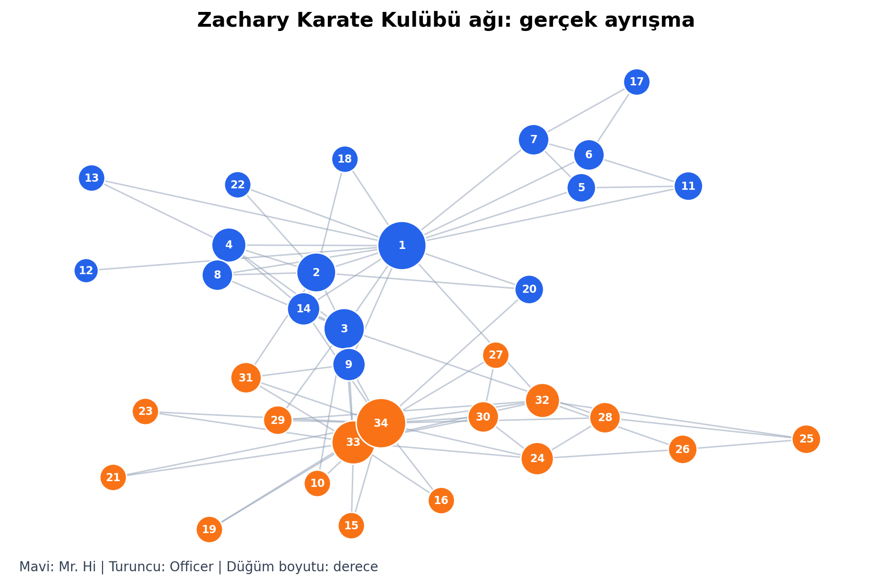

# Zachary Karate Kulübü Ağ Analizi

Bu çalışma, BİL403-503 Sosyal Ağlar dersi dönem projesi kapsamında Zachary
Karate Kulübü veri setinin yapısal özelliklerini ve topluluk yapısını inceler.

**Hazırlayan:** Barış Emre Ahi  
**Öğrenci No:** 221101045  
**Bölüm:** Bilgisayar Mühendisliği



## Projenin amacı

34 üye ve 78 sosyal ilişkiden oluşan ağ üzerinde temel ağ ölçümleri,
merkezilikler, topluluk analizi ve keşifsel istatistiksel sınamalar
uygulanmıştır. Analiz, kulübün daha sonra gerçekleşen iki gruplu ayrışmasının
çatışma öncesindeki bağlantı örüntüsünde ne ölçüde görülebildiğini araştırır.

## Kullanılan yöntemler

- Ağ tipi, düğüm ve kenar sayısı, yoğunluk ve derece dağılımı
- Yerel ve ortalama kümelenme katsayıları
- Bağlı bileşenler, ortalama en kısa yol ve çap
- Derece, aradalık, yakınlık ve özvektör merkezilikleri
- Girvan-Newman topluluk analizi
- Mann-Whitney U testi ve Spearman korelasyonu

## Temel bulgular

| Ölçüm | Sonuç |
|---|---:|
| Düğüm / kenar | 34 / 78 |
| Yoğunluk | 0,139 |
| Ortalama derece | 4,59 |
| Ortalama kümelenme | 0,571 |
| Ortalama en kısa yol | 2,41 |
| Çap | 5 |
| Girvan-Newman doğruluğu | %94,1 |
| Spearman rho | 0,905 |

Düğüm 1 ve 34, hem bağlantı sayısı hem de köprü rolü bakımından ağın en
belirgin aktörleridir. Girvan-Newman yöntemi gerçek kulüp ayrışmasını %94,1
doğrulukla yeniden üretmiştir.

## Dosyalar

- `projekod_221101045_baris_emre_ahi.ipynb`: Açıklamalı ve çalıştırılmış analiz notebook'u
- `src/analyze_karate.py`: Analizi komut satırından yeniden üretmek için Python betiği
- `analysis_outputs/`: Grafikler, düğüm ölçümleri, GraphML ve sonuç özeti
- `report/`: Proje raporu
- `presentation/`: Proje sunumu

## Çalıştırma

```bash
python -m venv .venv
```

Windows:

```bash
.venv\Scripts\activate
pip install -r requirements.txt
python src/analyze_karate.py
```

Notebook'u açmak için:

```bash
jupyter notebook projekod_221101045_baris_emre_ahi.ipynb
```

## Veri kaynağı

Veri, NetworkX içindeki `karate_club_graph()` fonksiyonu ile dağıtılan ve
Wayne W. Zachary'nin 1977 tarihli saha çalışmasına dayanan klasik sosyal ağ
verisidir.

Zachary, W. W. (1977). An information flow model for conflict and fission in
small groups. *Journal of Anthropological Research*, 33(4), 452-473.
https://doi.org/10.1086/jar.33.4.3629752
